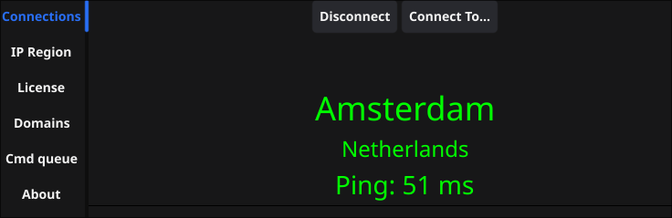
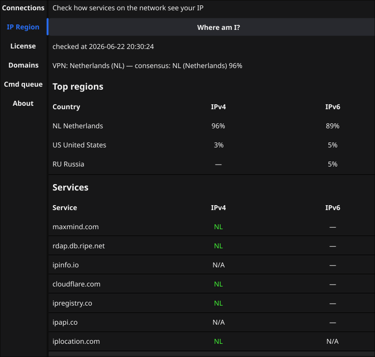

# AdGUI для AdGuard VPN


**Languages:** [English](README.md) · [Русский](README.ru.md) · [Esperanto](README.eo.md)

Простой графический интерфейс для управления CLI AdGuard VPN на Linux-рабочем столе (XLibre/X11 или Wayland).
Официально AdGuard предлагает GUI для Mac, Android и Windows, но для Linux его нет :(

> Проект не предоставляет VPN-функциональность. Это лишь вспомогательный интерфейс, оборачивающий
> настоящее VPN-приложение (`adguardvpn-cli`) для более удобной работы в
> настольной среде. Проект не имеет отношения к AdGuard и ни к одному из их
> продуктов.

GUI максимально близко повторяет возможности AdGuard VPN на Linux. К сожалению,
в Linux-версии AdGuard VPN меньше функций, чем в версиях для Mac и Windows.

Проект в разработке, но приложение полностью работоспособно.





Короткая [демка на Youtube](https://www.youtube.com/shorts/UpstI1BD-rE)

## Локализация

Язык интерфейса выбирается автоматически по системной локали (Fyne i18n). Поддерживаемые языки UI: английский (`en`), русский (`ru`) и эсперанто (`eo`). Английский используется по умолчанию, если подходящий перевод недоступен.
Другие языки могут быть добавлены позже.

## Установка

> Предварительно должен быть установлен `adguardvpn-cli` где-нибудь в PATH.

Готовых бинарников пока нет. На машине должна быть установлена среда разработки на Golang.

По умолчанию установка идёт в защищённый каталог `/usr/local/bin`, для чего нужны права root. Используйте `sudo`, `doas` или другую подходящую команду через переменную окружения SUDO:

`SUDO=sudo make install`

Или задайте `PREFIX` для установки в другой каталог, например в домашний:

`PREFIX=~/bin make install`

### Sudo и TUN-режим

`adguardvpn-cli` в режиме TUN настраивает сетевые интерфейсы и маршруты от root, поэтому внутри CLI вызывается `sudo`. adgui подставляет изолированный `sudo`-wrapper только в окружение дочерних процессов CLI (`$XDG_RUNTIME_DIR/adgui/<pid>/`). Глобальный `PATH` login-shell, `~/.bashrc` и системные каталоги **не изменяются**.

adgui передаёт CLI минимальное desktop/XDG-окружение (пользователь, локаль, display/session) и запускает `adguardvpn-cli` без controlling terminal, чтобы `sudo` не спрашивал пароль в терминале, из которого стартовал adgui. Если есть runtime-файл `.pass`, wrapper использует askpass (`sudo -A`); иначе — неинтерактивный `sudo -n` на реальной команде (кэш credentials и NOPASSWD, в том числе на конкретные команды). Диалог пароля в GUI появляется только когда askpass включён и нет валидного ticket; пароль сохраняется в `.pass` (mode `0600`) и затирается при выходе.

В `~/.config/adgui/adguirc` можно задать (при первом запуске adgui создаёт этот файл-шаблон с закомментированными ключами и значениями по умолчанию):

- `ADGUARD_CMD` — путь к `adguardvpn-cli` (по умолчанию: `adguardvpn-cli`)
- `ADGUARD_KILL_CMD` — неинтерактивная команда завершения (например `/usr/bin/sudo -n kill -TERM`)
- `ADGUARD_SUDO_WRAP=0` — полностью отключить wrapper (отладка / полностью passwordless)
- `ADGUARD_SUDO_ASKPASS=0` — оставить wrapper, но не спрашивать пароль; только `sudo -n` (для passwordless sudoers)

Приоритет: переменная окружения → активный ключ в `adguirc` → значение по умолчанию в коде.

## Возможности

Сначала войдите в аккаунт AdGuard через `adguardvpn-cli`. Я намеренно не добавил это в GUI — достаточно сделать один раз.

### Поддержка системного трея

В меню иконки в трее доступны: показать панель, подключиться к локации, подключиться к предыдущей локации, настройка исключений сайтов, отключить VPN.

### Исключения сайтов (вкладка «Домены»)

Вкладка «Домены» на панели управления позволяет управлять исключениями сайтов для AdGuard VPN. Можно настроить, какие домены обходят VPN или, наоборот, идут через него.

#### Режимы исключений
- **Общий режим**: домены из списка исключены из VPN (трафик идёт напрямую)
- **Выборочный режим**: только домены из списка используют VPN-соединение

#### Автоматическое сохранение
Списки исключений разделены по режимам (общий и выборочный) и автоматически сохраняются в локальные файлы при любом изменении (добавление, вставка, импорт, удаление, очистка):
- Общий режим: `~/.config/adgui/site-exclusions/general.txt`
- Выборочный режим: `~/.config/adgui/site-exclusions/selective.txt`

При переключении режима исключений текущий активный список сохраняется в соответствующий файл, а список нового режима автоматически загружается и применяется в CLI.

#### Управление доменами

- **Фильтр/добавление**: используйте текстовое поле вверху, чтобы отфильтровать существующие домены или ввести новый
- **Добавить**: нажмите кнопку «Добавить», чтобы добавить домен из текстового поля в список исключений
- **Удалить**: нажмите кнопку «X» рядом с доменом, чтобы убрать его из списка

### Импорт/экспорт

Кнопки «Импорт» и «Экспорт» позволяют сохранять и восстанавливать списки исключений доменов для **текущего режима исключений** (общего или выборочного).

#### Экспорт

Нажмите **Экспорт**, чтобы сохранить домены текущего режима в файл:

1. Откроется системный диалог сохранения с именем по умолчанию `<mode>.adgui` (`general.adgui` или `selective.adgui`)
2. Выберите путь и имя файла (расширение по умолчанию: `.adgui`)
3. Файл сохраняется с экспортированными доменами

**Примечание**: экспортируются только домены, видимые при текущем фильтре. Если фильтр активен, сохранятся лишь подходящие домены. Сбросьте фильтр, чтобы экспортировать все домены текущего режима.

#### Импорт

Нажмите **Импорт**, чтобы загрузить домены из файла в **текущий режим исключений**:

1. Откроется системный диалог открытия (любое расширение файла)
2. Выберите файл с одним доменом на строку
3. Новые домены добавляются в список текущего режима в adgui и сразу применяются в AdGuard VPN
4. Дубликаты (уже присутствующие в списке) автоматически пропускаются

При импорте показывается индикатор прогресса, по завершении список обновляется. Импортированные домены сохраняются в файл текущего режима (`general.txt` или `selective.txt`).

### Миграция

Если у вас остались старые единые текстовые файлы исключений, их можно перенести в новые файлы по режимам с помощью прилагаемого Python-скрипта:

```bash
python3 scripts/migrate-site-exclusions.py --target-mode [general|selective]
```

По умолчанию скрипт сканирует устаревший каталог `~/.local/share/adgui/site-exclusions/` и объединяет все файлы (кроме `general.txt` и `selective.txt`) в целевой файл режима в `~/.config/adgui/site-exclusions/` с автоматическим удалением дубликатов. Входные файлы можно также указать явно флагом `--input <path>`.

#### Формат файла

Файлы экспорта/импорта — обычный текст, один домен на строку. Расширение экспорта по умолчанию — `.adgui`. Эти файлы можно создавать и редактировать вручную:

```
example.com
subdomain.example.org
another-site.net
```

### Закладки локаций («Подключиться к...»)

Селектор **Подключиться к...** позволяет закладывать VPN-локации через колонку со звёздочкой справа. Закладки сохраняются в:

- `~/.config/adgui/bookmarks`

Нажмите заголовок колонки **★**, чтобы переключить сортировку с приоритетом закладок. Нажмите звёздочку в строке, чтобы добавить или убрать закладку без подключения.

Флаги стран в списке локаций используют SVG-ресурсы из [lipis/flag-icons](https://github.com/lipis/flag-icons) (лицензия MIT), встроенные в бинарник приложения.

### Регион IP (определение страны)

Эта функция реализована только в AdGUI и не входит в AdGuard VPN. Она помогает оценить эффективность VPN-соединения. Вкладка **Регион IP** на панели управления проверяет, как GeoIP-базы и популярные веб-сервисы классифицируют ваш текущий исходящий IP-адрес. Используйте её, чтобы убедиться, что AdGuard VPN направляет трафик через ожидаемую страну, или увидеть, расходятся ли сервисы в определении вашего местоположения.

Проверка запускается только при нажатии **Где я?** — открытие вкладки не обращается к сети. Во время сканирования строка прогресса показывает текущий сервис и счётчик попыток; повторное нажатие кнопки отменяет проверку.

#### Результаты

- **Сводка** — топ стран по числу сервисов, сообщивших каждый ISO-код (проценты IPv4 и IPv6, когда доступны оба)
- **Таблица сервисов** — коды стран по каждому сервису для IPv4 и IPv6
- **Сравнение с VPN** — при подключении сравнивает выбранную VPN-локацию с консенсусом внешних проверок; несовпадения отмечены `!` в таблице

Основные пробы запрашивают GeoIP API (MaxMind, ipinfo.io, Cloudflare, ip-api.com и другие). Пользовательские пробы определяют регион по ответам популярных сайтов (Google, YouTube, Netflix, Spotify, Steam и другие). Логика портирована из [Davoyan/ipregion](https://github.com/Davoyan/ipregion) (лицензия MIT).

#### Необязательные API-ключи

Некоторые сервисы проверки региона принимают собственные API-ключи. Создайте `~/.config/adgui/service-keys` (формат INI) с любым из:

```ini
IPREGISTRY_KEY=your_key
GEOAPIFY_KEY=your_key
SPOTIFY_CLIENT_ID=your_client_id
SPOTIFY_API_KEY=your_api_key
AIRPORT_CODES_AUTH=your_token
```

Если файл или ключ отсутствует, где возможно используются встроенные демо-значения; остальные сервисы работают без ключей.

## Код с помощью ИИ

Я активно использую LLM для генерации больших частей кода, тестов, ревью кода, локализации и документации этого проекта. Это был эксперимент по созданию GUI (на фреймворке Fyne) на Go с помощью LLM. В целом успешный, хотя некоторые части пришлось доработать вручную. Весь код проверен мной.

Что делалось посредством LLM?
- генерация кода запланированных фич
- отладка кода
- генерация тестов
- написание документации
- локализация на другие языки

Что делалось человеком?
- выбор архитектурных решений
- ревью кода
- рефакторинг кода по неудачно выбранным LLM решениям
- поправки стиля кода для следования соглашениям Go
- поправки стиля документации
- мелкие поправки в локализациях
- отладка сложных случаев, где LLM не справилась

## Starware

Это starware :) Если код оказался полезным, ставь звезду ⭐!

## Лицензия

На условиях GPL v3.
